<h2>TensorFlow-FlexUNet-Image-Segmentation-MICCAI-FeTS2021-T2W-Subset (Updated: 2026/04/29)</h2>

Sarah T. Arai 
Software Laboratory antillia.com 
<ul>
<li>2026/04/29: Updated infer3d method of <a href="./src/TensorFlowFlexModel.py">TensorFlowFexModel.py</a>, and ran 5.infer3d.bat.</li>
<li>2026/04/29: Generated overlays.gif from new maskoverlay PNG files</li>
</ul>
 
This is the first experiment of Image Segmentation for MICCAI-FeTS2021-T2W-Subset,
 based on our 
TensorFlowFlexUNet (TensorFlow Flexible UNet Image Segmentation Model for Multiclass) 
and a 512x512 pixels upscaled PNG 
<a href="https://drive.google.com/file/d/1uC1DWHKXb6oUWW_Bis8c2Oh-3xtLwZdD/view?usp=sharing">
MICCAI-FeTS2021-T2W-ImageMask-Subset.zip
</a> (<a href="https://creativecommons.org/licenses/by/4.0/">CC BY 4.0</a>), 
which was derived by us from    

<a href="https://www.kaggle.com/datasets/syedsajid/brats2021/data">
BRATS2021
</a>  on the kaggle web site 
 
 

<b>Acutual Image Segmentation for  MICCAI-FeTS2021-T2W Images of 512x512 pixels</b> 
As shown below, the inferred masks predicted by our segmentation model trained on the 
PNG dataset appear similar to the ground truth masks.  
<b>class_color_map = {NCR (Necrotic Tumor Core):red, ED (Edema):green, ET (Enhancing Tumor):blue} </b>
 
<table>
<tr>
<th>Input: image</th>
<th>Mask (ground_truth)</th>
<th>Prediction: inferred_mask</th>
</tr>
<tr>
<td>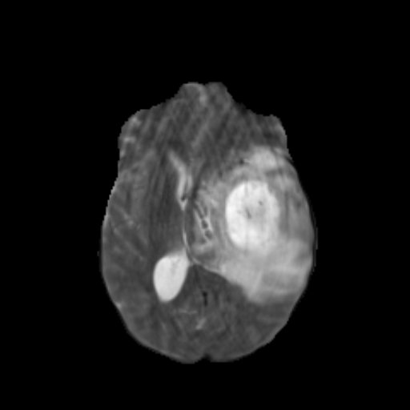</td>
<td>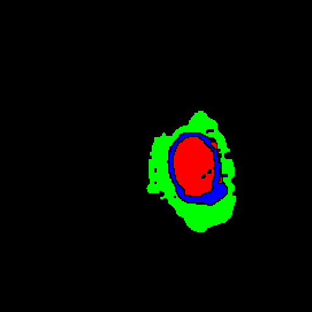</td>
<td>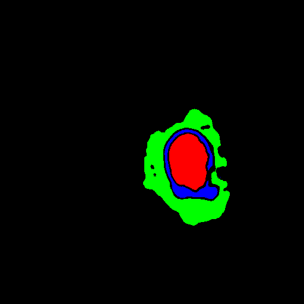</td>
</tr>
<tr>
<td>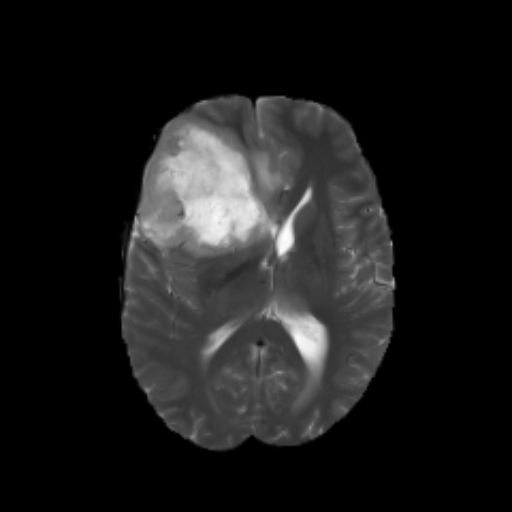</td>
<td>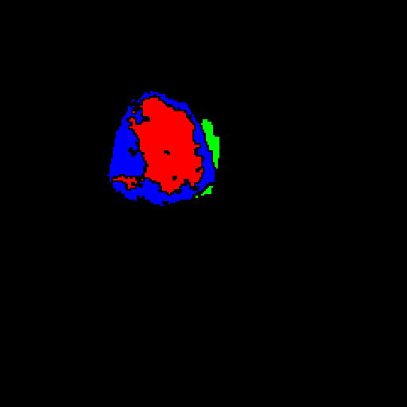</td>
<td>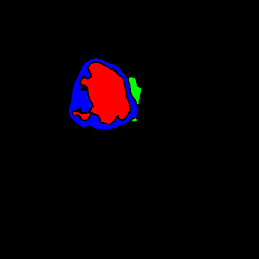</td>
</tr>
<tr>
<td>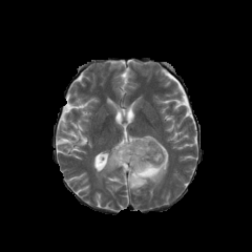</td>
<td></td>
<td>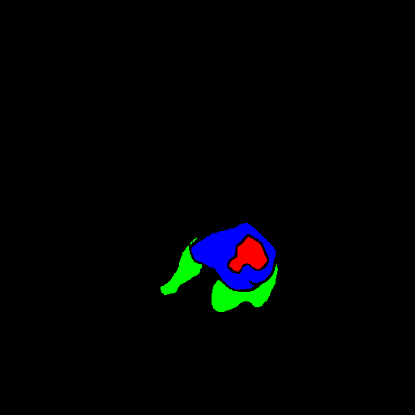</td>
</tr>
</table>

<h3>1. Dataset Citation</h3>
The dataset used here was derived from    
<a href="https://www.kaggle.com/datasets/syedsajid/brats2021/data">
<b>BRATS2021
</a> </b>
on the kaggle web site.
  
For more information on RATS2021, please refer to <a href="http://braintumorsegmentation.org/">
RSNA-ASNR-MICCAI Brain Tumor Segmentation (BraTS) Challenge 2021</a> and 
<a href="https://www.cancerimagingarchive.net/analysis-result/rsna-asnr-miccai-brats-2021/">
RSNA-ASNR-MICCAI-BraTS-2021 | RSNA-ASNR-MICCAI-BraTS-2021</a>
  
The following description on BraTS2021 was taken from the web site:  
<a href="http://braintumorsegmentation.org/"><b>RSNA-ASNR-MICCAI Brain Tumor Segmentation (BraTS) Challenge 2021</b></a>
 
 
The Brain Tumor Segmentation (BraTS) challenge celebrates its 10th anniversary, and this year is jointly organized by 
the Radiological Society of North America (RSNA), the American Society of Neuroradiology (ASNR), and 
the Medical Image Computing and Computer Assisted Interventions (MICCAI) society.
  
The RSNA-ASNR-MICCAI BraTS 2021 challenge utilizes multi-institutional 
pre-operative baseline multi-parametric magnetic resonance imaging (mpMRI) scans, and focuses on the evaluation of state-of-the-art methods for (Task 1) the segmentation of intrinsically heterogeneous brain glioblastoma sub-regions in mpMRI scans. Furthemore, this BraTS 2021 challenge also focuses on the 
evaluation of (Task 2) classification methods to predict the MGMT promoter methylation status.
 
 
<b>Imaging Data Description</b> 
All BraTS mpMRI scans are available as NIfTI files (.nii.gz) for Task 1 (Segmentation) and as DICOM (.dcm) files for Task 2 
(Classification). These mpMRI scans describe a) native (T1) and b) post-contrast T1-weighted (T1Gd), c) 
T2-weighted (T2), and d) T2 Fluid Attenuated Inversion Recovery (T2-FLAIR) volumes, and were 
acquired with different clinical protocols and various scanners from multiple institutions, mentioned as 
data contributors here. We intend to release all corresponding de-identified DICOM (.dcm) and NIFTI (.nii.gz) 
files for both tasks after the conclusion of the challenge.

 
 
All the imaging datasets have been segmented manually, by one to four raters, following the same annotation protocol, 
and their annotations were approved by experienced board-certified neuro-radiologists.  
Annotations comprise  
the GD-enhancing tumor (ET — label 4),  
the peritumoral edematous/invaded tissue (ED — label 2),  
and the necrotic tumor core (NCR — label 1),  
as described both in the BraTS 2012-2013 TMI paper(opens in a new window) and in the latest 
BraTS summarizing paper. The ground truth data were created after their pre-processing, 
i.e., co-registered to the same anatomical template, interpolated to the same resolution (1 mm^3) and skull-stripped.
  
<b>Data Usage Agreement / Citations</b> 
You are free to use and/or refer to the BraTS datasets in your own research, provided that you always
 cite the following three manuscripts:
   
[1] <a href="https://arxiv.org/abs/2107.02314"> U.Baid, et al., "The RSNA-ASNR-MICCAI BraTS 2021 Benchmark on Brain Tumor Segmentation and Radiogenomic Classification", arXiv:2107.02314, 2021
</a>  
[2] <a href="https://pubmed.ncbi.nlm.nih.gov/25494501/">B. H. Menze, A. Jakab, S. Bauer, J. Kalpathy-Cramer, K. Farahani, J. Kirby, et al. "The Multimodal Brain Tumor Image Segmentation Benchmark (BRATS)", IEEE Transactions on Medical Imaging 34(10), 1993-2024 (2015) DOI: 10.1109/TMI.2014.2377694 
</a>
  
[3] <a href="https://pubmed.ncbi.nlm.nih.gov/28872634/">S. Bakas, H. Akbari, A. Sotiras, M. Bilello, M. Rozycki, J.S. Kirby, et al., "Advancing The Cancer Genome Atlas glioma MRI collections with expert segmentation labels and radiomic features", Nature Scientific Data, 4:170117 (2017) DOI: 10.1038/sdata.2017.117(opens in a new window)
</a>
  
<b>License</b> 
<a href="https://creativecommons.org/licenses/by/4.0/">	CC BY 4.0</a>
  

<h3>
<a id="2">
2 MICCAI-FeTS2021-T2W-Subset ImageMask Dataset
</a>
</h3>
<h4>2.1 Download ImageMask Dataset</h4>
 If you would like to train this MICCAI-FeTS2021-T2W-Subset Segmentation model by yourself,
 please download the dataset from the google drive 
<a href="https://drive.google.com/file/d/1uC1DWHKXb6oUWW_Bis8c2Oh-3xtLwZdD/view?usp=sharing">
MICCAI-FeTS2021-T2W-ImageMask-Subset.zip</a>  (<a href="https://creativecommons.org/licenses/by/4.0/">CC BY 4.0</a>), 
expand the downloaded dataset, and put it under <b>./dataset</b> folder to be:
<pre>
./dataset
└─MICCAI-FeTS2021-T2W-Subset
    ├─test
    │   ├─images
    │   └─masks
    ├─train
    │   ├─images
    │   └─masks
    └─valid
        ├─images
        └─masks
</pre>
 
<b>MICCAI-FeTS2021-T2W-Subset Statistics</b> 
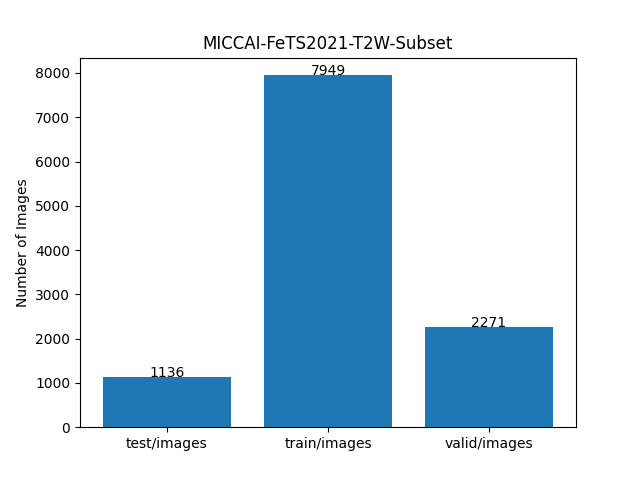 
 
As shown above, the number of images of train and valid datasets is large enough to use for a training set of our segmentation model.
 
 
<h4>2.2 ImageMask Dataset Derivation</h4>
The folder structure of <b>MICCAI_FeTS2021_TrainingData</b> is the following. 
<pre>
./MICCAI_FeTS2021_TrainingData
  ├─FeTS21_Training_001
  │  ├─FeTS21_Training_001_flair.nii
  │  ├─FeTS21_Training_001_seg.nii  
  │  ├─FeTS21_Training_001_t1.nii
  │  ├─FeTS21_Training_001_t1ce.nii
  │  └─FeTS21_Training_001_t2.nii
...
  ├─FeTS21_Training_002
...
  └─FeTS21_Training_369
      ├─FeTS21_Training_001_flair.nii
      ├─FeTS21_Training_001_seg.nii  
      ├─FeTS21_Training_001_t1.nii
      ├─FeTS21_Training_001_t1ce.nii
      └─FeTS21_Training_001_t2.nii
</pre>
We used a simple Python script and the following class-color-mapping table to generate our PNG T2W dataset 
with colorized masks from PNG files in brain_t2 and segmentation_mask folders in half of the original dataset.
  
<table border="1" style="border-collapse: collapse;">

<tr><th>Index</th><th>Category</th><th>Color </th><th>RGB triplet</th></tr>
<tr>
<td>1</td><td>NCR (necrotic tumor core)</td><td>red</td><td>(255,0,0)</td><tr>
<td>2</td><td>ED (peritumoral edematous/invaded tissue)</td><td>green</td><td>(0,255,0)</td><tr>
<td>3</td><td>ET (GD-enhancing tumor)</td><td>blue</td><td>(0,0,255)</td><tr>
</table>
 
For simplicity, we excluded all empty black masks and their corresponding images to generate our PNG dataset, which were 
irrelevant to train our segmentation model, 
and upscaled all images and masks to 512x512 pixels from the original 240x240 pixels.
 

<h4>2.3 Image and Mask samples</h4>
<b>Train_images_sample</b> 
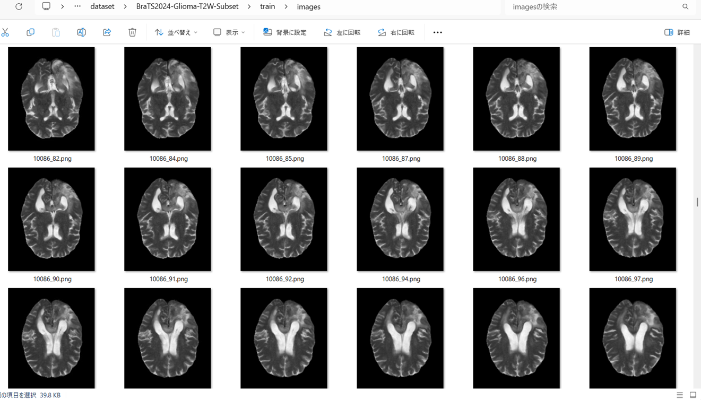
 
<b>Train_masks_sample</b> 
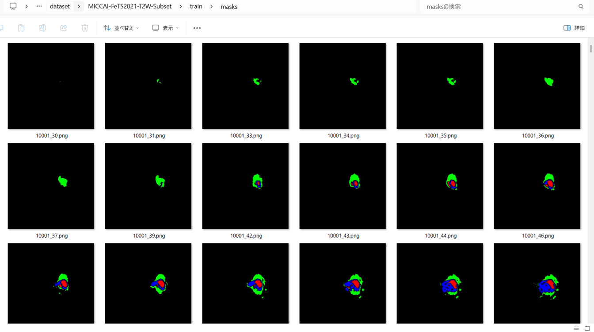
 
 
<h3>
3 Train TensorFlowFlexUNet Model
</h3>
 We trained MICCAI-FeTS2021-T2W-Subset TensorFlowFlexUNet Model by using the following
<a href="./projects/TensorFlowFlexUNet/MICCAI-FeTS2021-T2W-Subset/train_eval_infer.config"> <b>train_eval_infer.config</b></a> file.  
Please move to <b>./projects/TensorFlowFlexUNet/MICCAI-FeTS2021-T2W-Subset</b> foder, and run the following bat file. 
<pre>
>1.train.bat
</pre>
, which simply runs the following command. 
<pre>
>python ../../../src/TensorFlowFlexUNetTrainer.py ./train_eval_infer.config
</pre>

<b>Model parameters</b> 
Defined a small <b>base_filters = 16 </b> and large <b>base_kernels = (7,7)</b> for the first Conv Layer of Encoder Block of 
<a href="./src/TensorFlowFlexUNet.py">TensorFlowFlexUNet.py</a> 
and a large num_layers (including a bridge between Encoder and Decoder Blocks).
<pre>
[model]
;You may specify your own UNet class derived from our TensorFlowFlexModel
model         = "TensorFlowFlexUNet"
generator     =  False
image_width    = 512
image_height   = 512
image_channels = 3
num_classes    = 4

base_filters   = 16
base_kernels   = (11,11)
num_layers     = 8
dropout_rate   = 0.05
dilation       = (1,1)
</pre>
<b>Learning rate</b> 
Defined a very small learning rate.  
<pre>
[model]
learning_rate  = 0.00007
</pre>
<b>Loss and metrics functions</b> 
Specified "categorical_crossentropy" and <a href="./src/dice_coef_multiclass.py">"dice_coef_multiclass"</a>. 
<pre>
[model]
loss           = "categorical_crossentropy"
metrics        = ["dice_coef_multiclass"]
</pre>
<b>Dataset class</b> 
Specifed <a href="./src/ImageCategorizedMaskDataset.py">ImageCategorizedMaskDataset</a> class. 
<pre>
[dataset]
class_name    = "ImageCategorizedMaskDataset"
</pre>
 
<b>Learning rate reducer callback</b> 
Enabled learing_rate_reducer callback, and a small reducer_patience.
<pre> 
[train]
learning_rate_reducer = True
reducer_factor     = 0.5
reducer_patience   = 4
</pre>
<b>Early stopping callback</b> 
Enabled early stopping callback with patience parameter.
<pre>
[train]
patience      = 10
</pre>

<b>RGB Color map</b> 
rgb color map dict for MICCAI-FeTS2021-T2W-Subset 1+3 classes. 
<pre>
[mask]
mask_datatyoe    = "categorized"
mask_file_format = ".png"
;                     NCR:red, ED:green,  ET:blue
rgb_map = {(0,0,0):0,(255,0,0):1,(0,255,0):2, (0,0,255):3, }
</pre>

<b>Epoch change inference callback</b> 
Enabled <a href="./src/EpochChangeInfereuncer.py">epoch_change_infer callback</a></b>. 
<pre>
[train]
epoch_change_infer       = True
epoch_change_infer_dir   =  "./epoch_change_infer"
num_infer_images         = 6
</pre>

By using this callback, on every epoch_change, the inference procedure can be called
 for 6 images in <b>mini_test</b> folder. This will help you confirm how the predicted mask changes 
 at each epoch during your training process.    

<b>Epoch_change_inference output at starting (epoch 1,2,3)</b> 
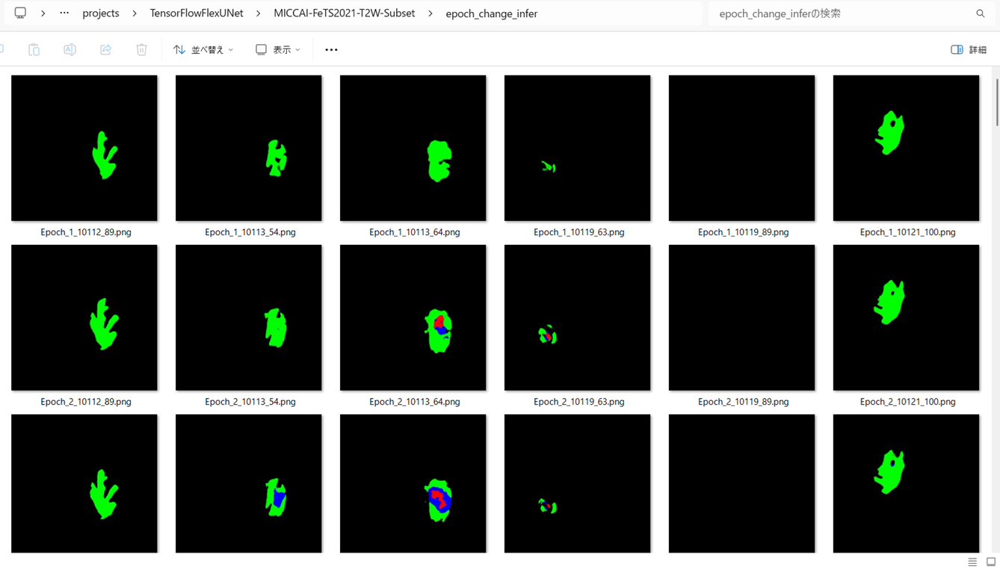 
 
<b>Epoch_change_inference output at middlepoint (epoch 23,24,25)</b> 
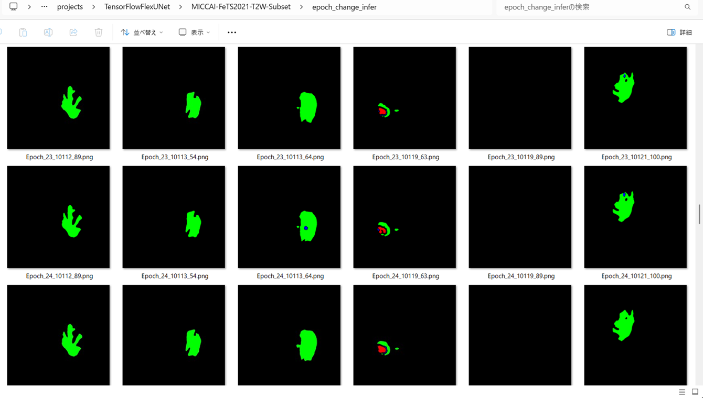 
 
<b>Epoch_change_inference output at ending (epoch 48,49,50)</b> 
 
 
In this experiment, the training process was terminated at epoch 50.  
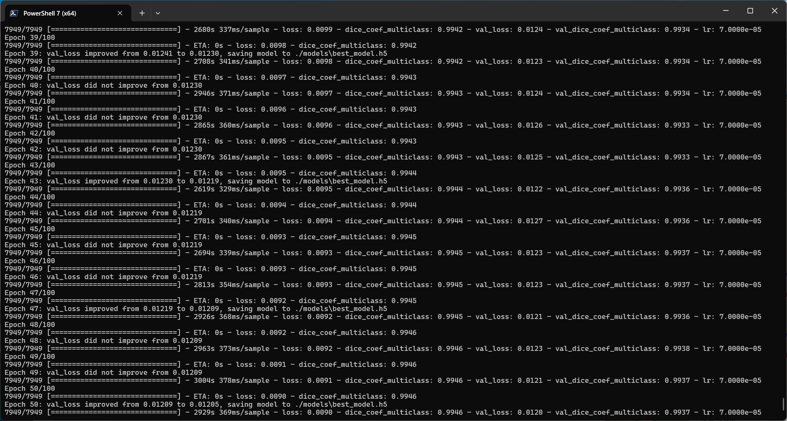 
 

<a href="./projects/TensorFlowFlexUNet/MICCAI-FeTS2021-T2W-Subset/eval/train_metrics.csv">train_metrics.csv</a> 
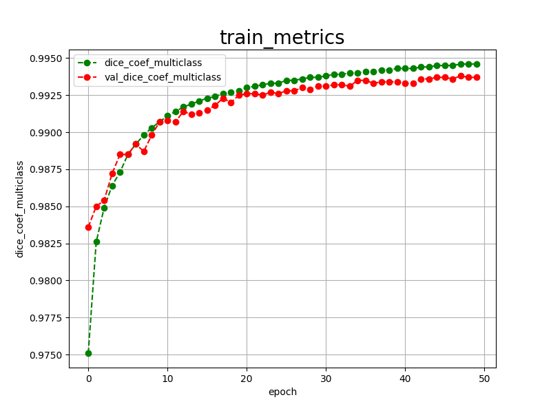 

 
<a href="./projects/TensorFlowFlexUNet/MICCAI-FeTS2021-T2W-Subset/eval/train_losses.csv">train_losses.csv</a> 
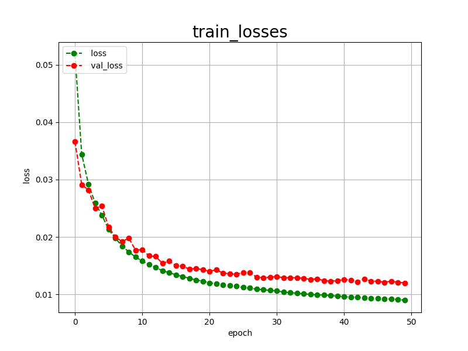 

 
<h3>
4 Evaluation
</h3>
Please move to <b>./projects/TensorFlowFlexUNet/MICCAI-FeTS2021-T2W-Subset</b> folder, 
and run the following bat file to evaluate TensorFlowFlexUNet model for MICCAI-FeTS2021-T2W-Subset. 
<pre>
./2.evaluate.bat
</pre>
This bat file simply runs the following command.
<pre>
python ../../../src/TensorFlowFlexUNetEvaluator.py ./train_eval_infer.config
</pre>

Evaluation console output: 
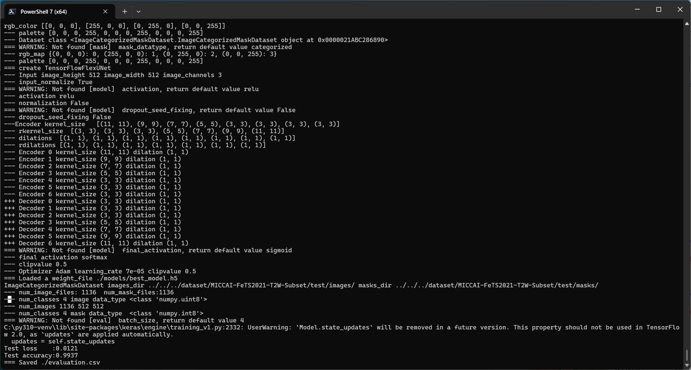
  

<a href="./projects/TensorFlowFlexUNet/MICCAI-FeTS2021-T2W-Subset/evaluation.csv">evaluation.csv</a> 
The loss (categorical_crossentropy) to this MICCAI-FeTS2021-T2W-Subset/test was low, and dice_coef_multiclass high as shown below.
 
<pre>
categorical_crossentropy,0.0121
dice_coef_multiclass,0.9937
</pre>
 

<h3>
5 Inference
</h3>
Please move <b>./projects/TensorFlowFlexUNet/MICCAI-FeTS2021-T2W-Subset</b> folder, and run the following bat file to infer segmentation regions for images by the Trained-TensorFlowFlexUNet model for MICCAI-FeTS2021-T2W-Subset. 
<pre>
>./3.infer.bat
</pre>
This simply runs the following command.
<pre>
>python ../../../src/TensorFlowFlexUNetInferencer.py ./train_eval_infer.config
</pre>

<b>mini_test_images</b> 
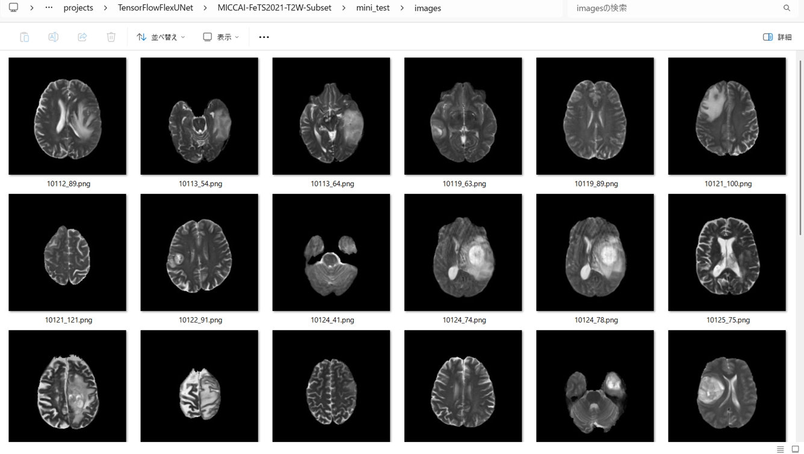 
<b>mini_test_mask(ground_truth)</b> 
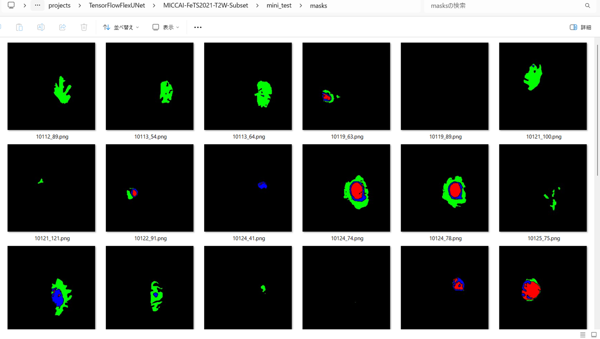 

<b>Inferred test masks</b> 
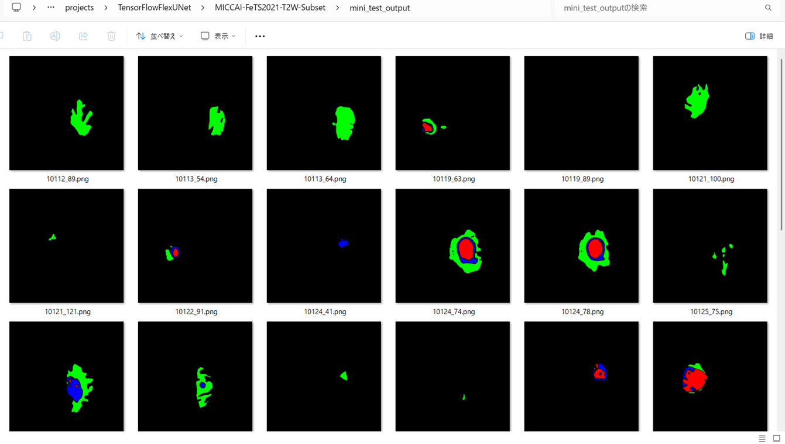 
 

<b>Enlarged images and masks for  MICCAI-FeTS2021-T2W Images of 512x512 pixels</b> 
As shown below, the inferred masks predicted by our segmentation model trained on the 
PNG dataset appear similar to the ground truth masks.  
<b>class_color_map = {NCR (Necrotic Tumor Core):red, ED (Edema):green, ET (Enhancing Tumor):blue} </b>
<table>
<tr>
<th>Input: Image</th>
<th>Mask (ground_truth)</th>
<th>Prediction: Inferred-mask</th>
</tr>

<tr>
<td>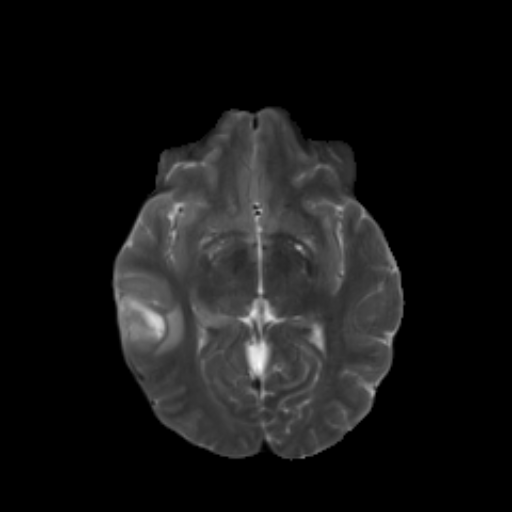</td>
<td>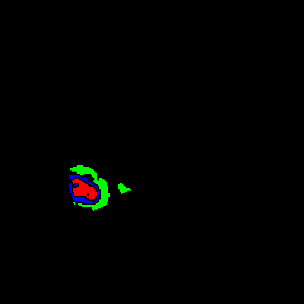</td>
<td>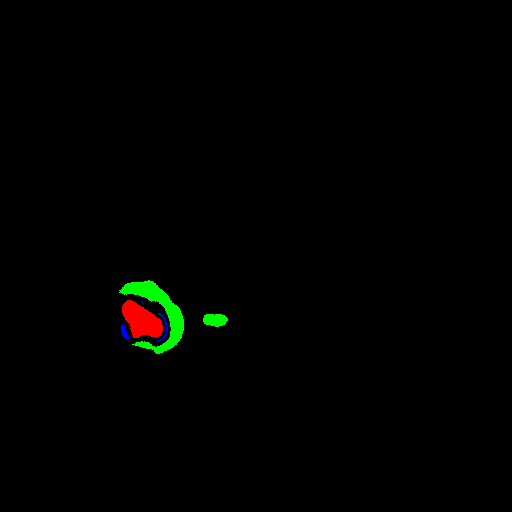</td>
</tr>

<tr>
<td></td>
<td></td>
<td></td>
</tr>

<tr>
<td>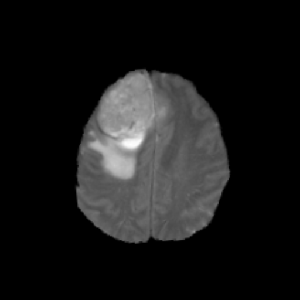</td>
<td>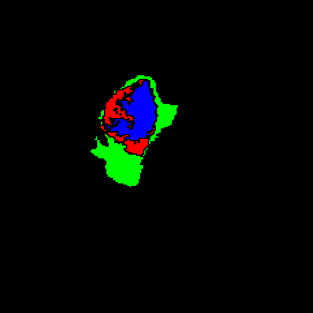</td>
<td>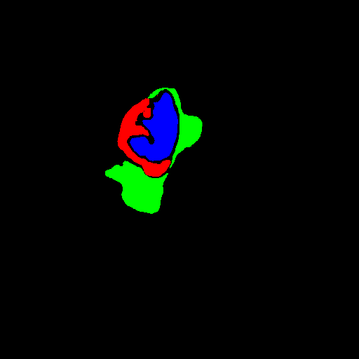</td>
</tr>

<tr>
<td>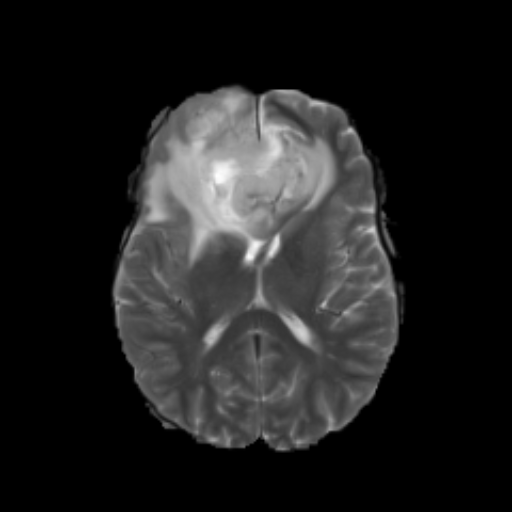</td>
<td>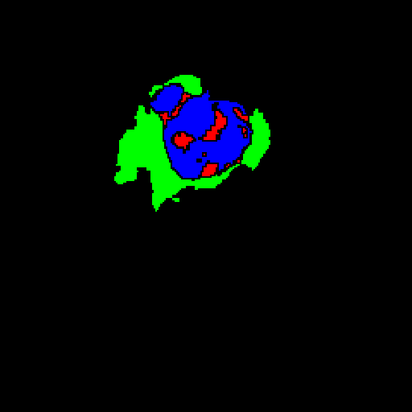</td>
<td>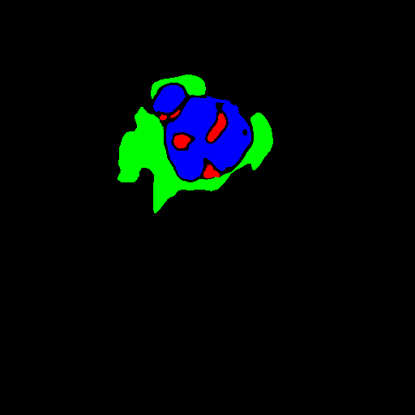</td>
</tr>

<tr>
<td>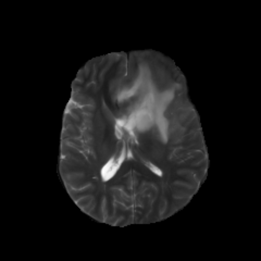</td>
<td>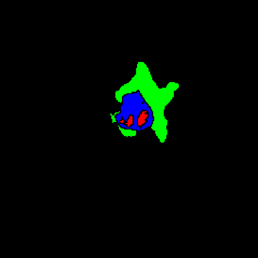</td>
<td>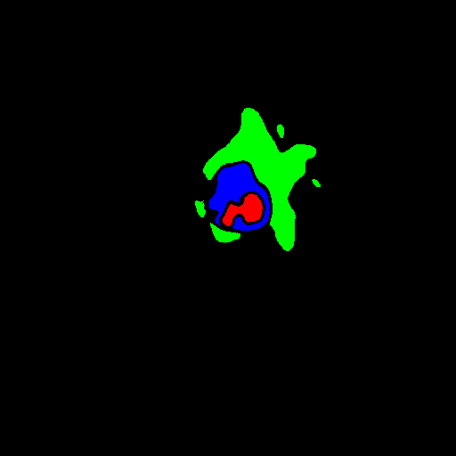</td>
</tr>

<tr>
<td>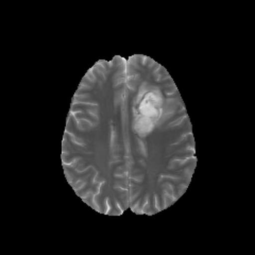</td>
<td>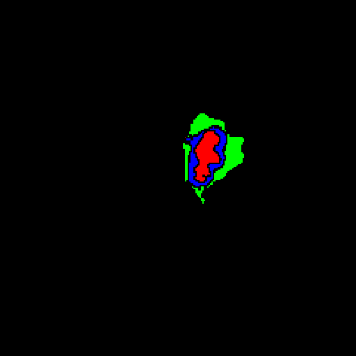</td>
<td>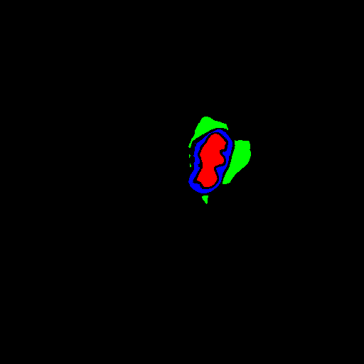</td>
</tr>
</table>

 
<h3>
6 3D Volume Segmentation
</h3>
Please move <b>./projects/TensorFlowFlexUNet/MICCAI-FeTS2021-T2W-Subset</b> folder, and run the following bat file to infer images segmentation for 2D slices of 3D volume NIfTI files
 by the Trained-TensorFlowFlexUNet model for MICCAI-FeTS2021-T2W-Subset. 
<pre>
>./5.infer3d.bat
</pre>
This simply runs the following command.
<pre>
>python ../../../src/TensorFlowFlexUNet3DInferencer.py ./train_eval_infer.config
</pre>

<b>infer3d section </b> in <a href="./projects/TensorFlowFlexUNet/MICCAI-FeTS2021-T2W-Subset/train_eval_infer.config">
train_eval_infer.config
<a></b>
<pre>
[infer3d] 
;Specify an images_dir which contains NIfTI files
images_dir    = "./mini_test_3d/images/"

output_dir    = "./mini_test_3d_output/"

slice_shape_order = "hwd"
slice_resize   = (512,512) 
slice_rotation = cv2.ROTATE_90_CLOCKWISE 
mask_overlay  = True
</pre>

<b>Acutual Image Segmentation for 2D Slices of a MICCAI-FeTS2021-T2W Validation NIfTI</b> 

Some Slices, Inferred Masks and Mask overlays for a 3D volume <b>FeTS21_Validation_0100_t2.nii</b> file. 
 
<b>class_color_map = {NCR (Necrotic Tumor Core):red, ED (Edema):green, ET (Enhancing Tumor):blue} </b>
 
<table>
<tr>
<th>Input: Slice</th>
<th>Prediction: Inferred mask</th>
<th>Mask Overlay</th>
</tr>

<tr>
<td>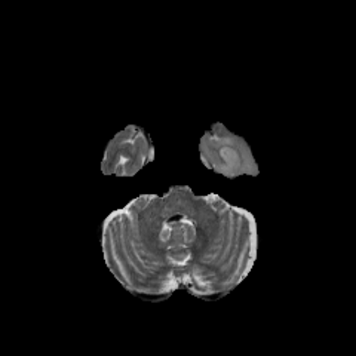</td>
<td>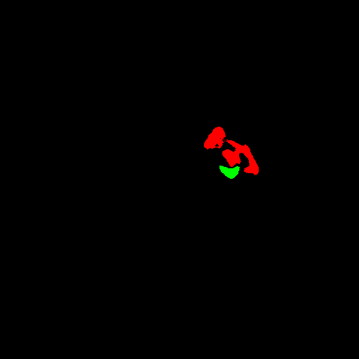</td>
<td>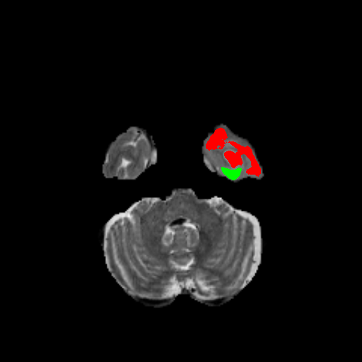</td>
</tr>

<tr>
<td>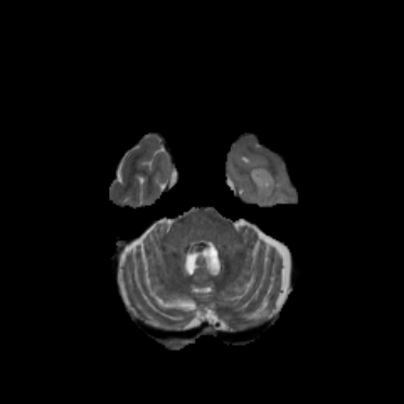</td>
<td>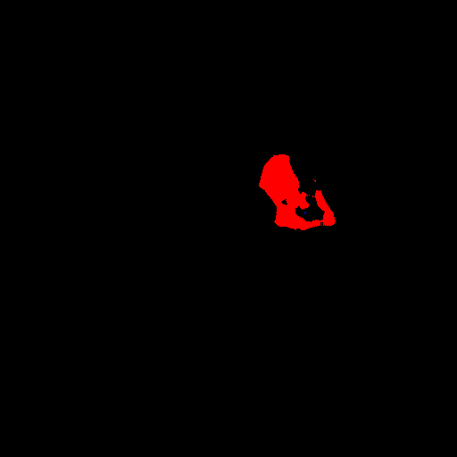</td>
<td>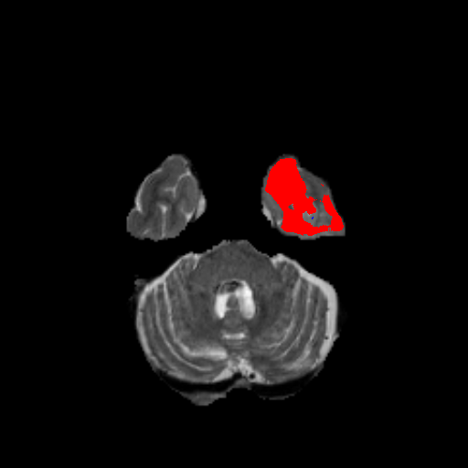</td>
</tr>
<tr>
<td>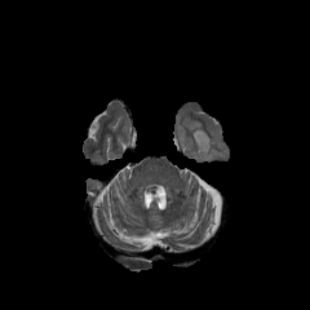</td>
<td>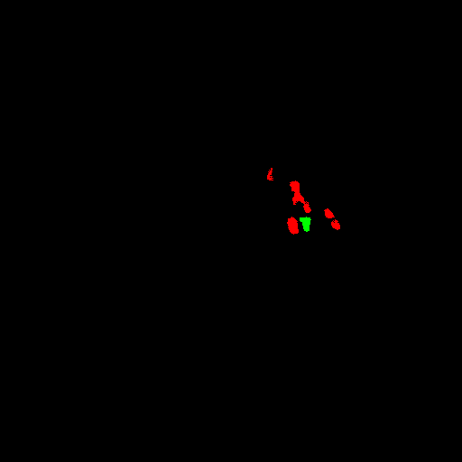</td>
<td>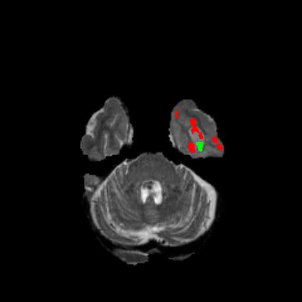</td>
</tr>
<tr>
<td>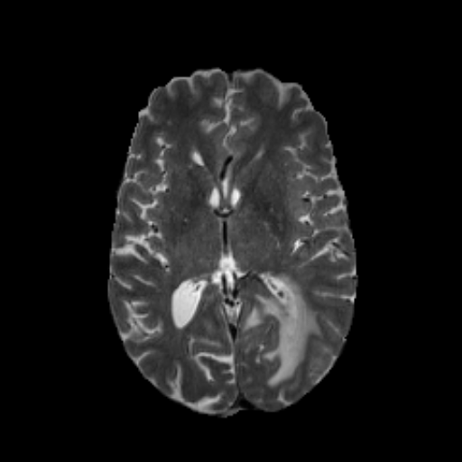</td>
<td>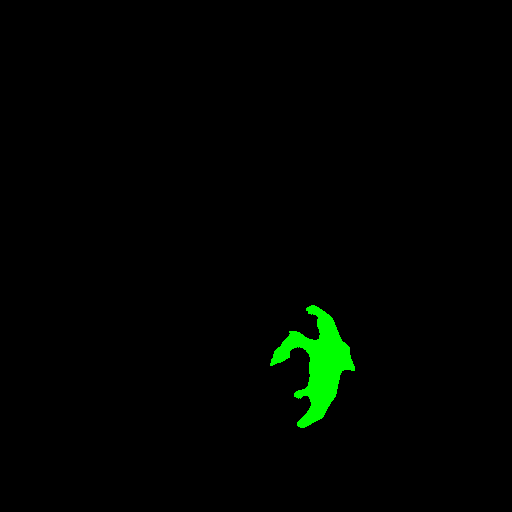</td>
<td>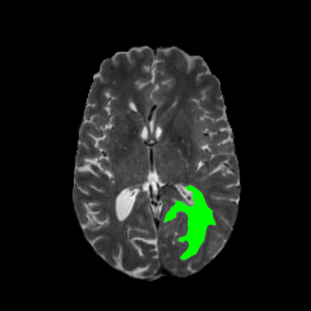</td>
</tr>
<tr>
<td>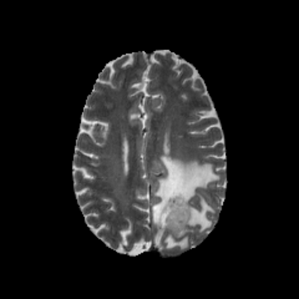</td>
<td>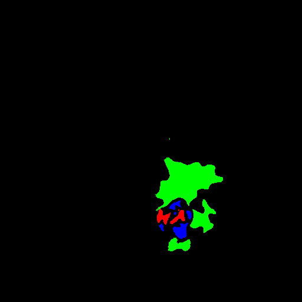</td>
<td>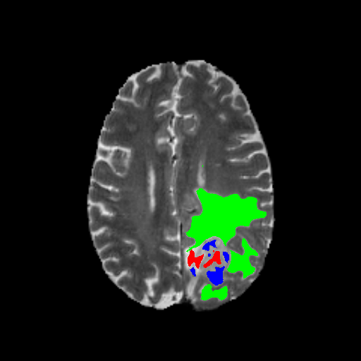</td>
</tr>
<tr>
<td></td>
<td></td>
<td></td>

</tr>
</table>

 
<h3>
7 MaskOverlay Video of 3D Volume Segmentation
</h3>
Please move to <b>./projects/TensorFlowFlexUNet/MICCAI-FeTS2021-T2W-Subset</b> folder, and run the following bat file 
to generate <b>overlays.mp4</b> or <b>overlay.gif</b> for MaskOverlays of 3D Volume Segmentation.  
<pre>
>./6.video3d.bat
</pre>
This simply runs the following command.
<pre>
>python ../../../src/MaskOverlayVideoGenerator.py ./train_eval_infer.config
</pre>
 

<b>infer3d section </b> in <a href="./projects/TensorFlowFlexUNet/BMICCAI-FeTS2021-T2W-Subset/train_eval_infer.config">
train_eval_infer.config
<a></b>

<pre>
[infer3d] 
mask_overlay  = True
;Specify ".mp4" or ".gif".
;video_fileformat  = ".mp4"
video_fileformat  = ".gif"
</pre>
 
<b>overlays.gif</b> 

 

<h3>
References
</h3>
<b>1. Multi-class glioma segmentation on real-world data with missing MRI sequences: comparison of three deep learning algorithms
</b> 
Hugh G. Pemberton, Jiaming Wu, Ivar Kommers, Domenique M. J. Müller, Yipeng Hu, Olivia Goodkin,  
Sjoerd B. Vos, Sotirios Bisdas, Pierre A. Robe, Hilko Ardon, Lorenzo Bello, Marco Rossi,  
Tommaso Sciortino, Marco Conti Nibali, Mitchel S. Berger, Shawn L. Hervey-Jumper, Wim Bouwknegt, 
 Wimar A. Van den Brink, Julia Furtner, Seunggu J. Han, Albert J. S. Idema, Barbara Kiesel, 
  Georg Widhalm, Alfred Kloet, Michiel Wagemakers, Aeilko H. Zwinderman, Sandro M. Krieg,  
  Emmanuel Mandonnet, Ferran Prados, Philip de Witt Hamer, Frederik Barkhof & Roelant S. Eijgelaar 
<a href="https://www.nature.com/articles/s41598-023-44794-0">
https://www.nature.com/articles/s41598-023-44794-0
</a>
 
 
<b>2. TensorFlow-FlexUNet-Image-Segmentation-UTSW-Glioma-T2W-Subset</b> 
Toshiyuki Arai 
<a href="https://github.com/sarah-antillia/TensorFlow-FlexUNet-Image-Segmentation-UTSW-Glioma-T2W-Subset">
https://github.com/sarah-antillia/TensorFlow-FlexUNet-Image-Segmentation-UTSW-Glioma-T2W-Subset
</a>
  
<b>3. TensorFlow-FlexUNet-Image-Segmentation-Model</b> 
Toshiyuki Arai 
<a href="https://github.com/sarah-antillia/TensorFlow-FlexUNet-Image-Segmentation-Model">
https://github.com/sarah-antillia/TensorFlow-FlexUNet-Image-Segmentation-Model
</a>
 
 
<b>4. TensorFlow-FlexUNet-Image-Segmentation-Multiclass-BraTS2020</b> 
Toshiyuki Arai 
<a href="https://github.com/sarah-antillia/TensorFlow-FlexUNet-Image-Segmentation-Multiclass-BraTS2020">
https://github.com/sarah-antillia/TensorFlow-FlexUNet-Image-Segmentation-Multiclass-BraTS2020
</a>

